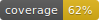

# Biology Benchmark (`biobench`)



This library is an easy-to-read benchmark for biology-related computer vision tasks.

It aims to make it easy to:

1. Evaluate new models.
2. Add new tasks.
3. Understand meaningful (or not) differences in model performance.

Check out the [docs](https://samuelstevens.me/biobench/) for an introduction.

## Getting Started

I use [uv](https://docs.astral.sh/uv/) for Python which makes it easy to manage Python versions, dependencies, virtual environments, etc.

To install uv, run `curl -LsSf https://astral.sh/uv/install.sh | sh`.

Then download at least one of the dataset.
NeWT is really easy to download.

```sh
uv run biobench/newt/download.py --dir ./newt
```

Download it wherever you want on your own filesystem.

Then run just the NeWT benchmark on all the default models.

```sh
CUDA_VISIBLE_DEVICES=0 uv run benchmark.py \
  --newt-run --newt-args.datadir ./newt
```

## Why?

**For computational biologists:** biobench gives you an overview of how different models perform on different tasks. If you have a concrete task that you need to solve, you can easily write a script that matches other, existing tasks and then evaluate many different models on your task. If you have an idea of a task, you can find the most similar existing task(s) on the leaderboard and compare model performance.

**For computer vision researchers:** biobench is a realistic set of benchmarks that more accurately reflect how your model will be used by downstream users. If you aim to train a new foundation vision model, be aware that downstream users will likely not fine-tune it, and will instead use the image embeddings to do all sorts of weird things. Your foundation model should output representations that are universally useful; biobench lets you measure to what degree this is true.

## Concrete Goals

*Easy*, *fast*, *reproducible*, *understandable* evaluation of PyTorch computer vision models across a suite of realistic biology-related vision tasks.

- *Easy*: one launch script, with all options documented in the code and in auto-generated web documentation.
- *Fast*: Each evaluation takes at most 1 hour of A100 or A6000 time. There might be $n$ evaluations, so $n$ hours of A100, but it is embarrassingly parallel and the launch script supports easy parallel running and reporting.
- *Reproducible*: the results include instructions to regenerate these results from scratch, assuming access to the `biobench` Git repo and that web dependencies have not changed.[^web-deps]
- *Understandable*: results are in a machine-readable format, but include a simple human-readable notebook for reading. Common analyses (mean score across all tasks) are included in the notebook and take under one second to run.

[^web-deps]: Web dependencies include things like datasets being available from their original source, Huggingface datasets can be re-downloaded, model checkpoints do not change, etc.


We at [Imageomics](https://imageomics.osu.edu) use this library for testing [BioCLIP](https://imageomics.github.io/bioclip) and other internal models  during development.
Because of this, there are two main classes of tasks:

1. Downstream applications. These are tasks like [KABR](https://samuelstevens.me/biobench/biobench/kabr/index.html) or [Beluga whale re-ID](https://samuelstevens.me/biobench/biobench/beluga/index.html). These tasks represent real problems that computer vision systems fail to solve today.
2. Benchmarks. These are made-up tasks like [RareSpecies](https://samuelstevens.me/biobench/biobench/rarespecies/index.html) that are artificial tasks, created to help us understand how useful a model might be in the real world for similar tasks.


## Road Map

1. Add contributing guide.
2. Add example images for each task to the docs.
3. Add 5-shot RareSpecies with simpleshot (like in BioCLIP paper). This is blocked because the Huggingface dataset doesn't work ([see this issue](https://huggingface.co/datasets/imageomics/rare-species/discussions/8)).
4. Add FishVista for localized trait prediction. This is another non-classification task, and we are specifically interested in traits. But it will take more work because we have to match bounding boxes and patch-level features which is challenging after resizes.

## Additional Tasks

[Counting insects on sticky insect traps](https://github.com/md-121/yellow-sticky-traps-dataset)
[Predicting plant stem angle](https://plantvision.unl.edu/datasets/download-panicoid-phenomap-1-dataset/)
